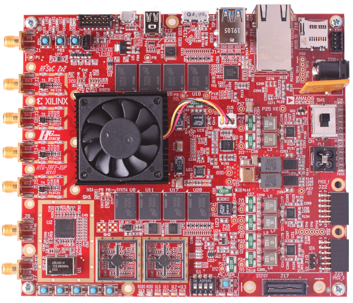

# 🚫 This repository has been archived

The latest RFSoC2x2 board files have moved to [https://github.com/Xilinx/RFSoC-PYNQ](https://github.com/Xilinx/RFSoC-PYNQ).

SD card images for the RFSoC2x2 can be found at [http://www.pynq.io/board](http://www.pynq.io/board).

---------------

# RFSoC 2x2 Kit

View the *RFSoC 2x2 Kit GitHub page* for this repository on [https://xilinx.github.io/RFSoC2x2-PYNQ/](https://xilinx.github.io/RFSoC2x2-PYNQ/).

This repository is used to host the *GitHub Documentation Page* for the
RFSoC2x2 kit. It includes the sources for the documentation, and board
collateral including source code and build scripts for the RFSoC 2x2 *base*
design. The design files in this repository are compatible with Xilinx
Vivado 2020.2, and PYNQ v2.7.0 and later.

Users can find the Vivado board files on
[Xilinx Vivado board repository](https://github.com/Xilinx/XilinxBoardStore/tree/2020.1/boards/Xilinx/rfsoc2x2/1.1).



## Steps to rebuild the PYNQ SD card image for the RFSoC 2x2 (Linux)

1. First choose a location to clone this repository:

	```bash
	export RFSoC2x2_REPO = <local_path>
	```

2. Do the following to clone this repository:

	```bash
	git clone https://github.com/Xilinx/RFSoC2x2-PYNQ.git $RFSoC2x2_REPO
	```

3. Rebuild the overlay files. 
   
	```bash
	cd $RFSoC2x2_REPO/board/RFSoC2x2/base
	make
	```

4. Go to PYNQ sdbuild folder and build the image with correct board folder 
   path:

	```bash
	make BOARDDIR=$RFSoC2x2_REPO
	```


Copyright (C) 2021 Xilinx, Inc

SPDX-License-Identifier: BSD-3-Clause
