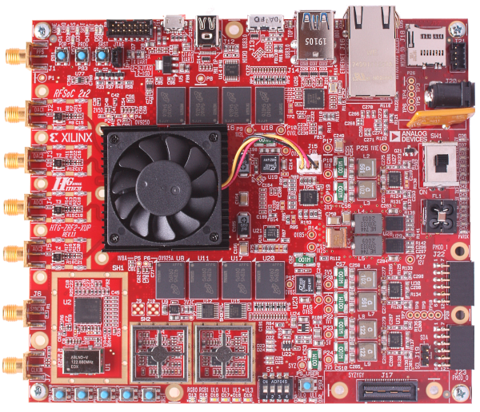

# RFSoC 2x2 kit

Xilinx’s Radio Frequency System-on-Chip ([RFSoC](https://www.xilinx.com/products/silicon-devices/soc/rfsoc.html)) devices have created a new class of integrated circuit architecture for the communications and instrumentation markets. RFSoCs combine high-accuracy ADCs- and DACs operating at Giga-samples per second, with programmable heterogeneous compute engines.

XUP is offering the **RFSoC 2x2 kit** exclusively for academic customers. 

The kit features:

* Affordable price of $1,899 available only to academic customers 
* RFSoC 2x2 board with 2 RF DAC and 2 RF ADC channels
* [PYNQ framework](http://www.pynq.io) with Jupyter Lab for exceptional ease-of-use 
* Open-source resources including teaching materials, notebooks, and design examples
* Complete end-to-end reference designs including spectrum analyzers and software defined radios
* GitHub-hosted repositories of all project materials
* Online [PYNQ community support forum](https://discuss.pynq.io/)

For more details on the RFSoC 2x2 hardware, see the [Board Overview](overview.md) page.

## Getting started

If you already have a board, go to the [RFSoC 2x2 Getting Started](./getting_started.md) guide. The getting started guide includes instructions and a video showing you how to setup your board to run PYNQ. 

See the [XUP RFSoC 2x2 page](http://www.xilinx.com/support/university/boards-portfolio/xup-boards/RFSoC2x2.html) for details on how to purchase a RFSoC 2x2

## RFSoC 2x2 overlays

Once your board is up and running, go to the [RFSoC 2x2 Overlays](./overlays.md) page for details about what you can do with your board, and how to build your own designs.

## PYNQ community

For more information on what you can do with PYNQ, see the [PYNQ community](http://www.pynq.io/community.html) pages which showcases example PYNQ designs. You can check for any overlays that support the RFSoC 2x2, or try to port existing designs to your board.

