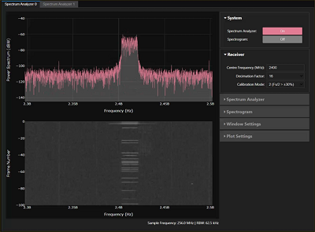
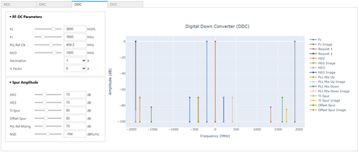

# RFSoC 2x2 overlays

## Base Overlay

The `base` overlay is included in the PYNQ image for the RFSoC 2x2 board and will be available for you to use from the first time you start your board.  The purpose of the base overlay design is to allow you to start exploring your board with PYNQ out-of-the-box. 

See the  [RFSoC 2x2 base overlay](./base_overlay.html) page for more details. 

## Spectrum Analyzer

[Placeholder for link]()

## RF Frequency planner

[Placeholder for link]()

## RFSoC Demonstration Repositories

* RFSoC OFDM Demonstration
* RFSoC QPSK Demonstration
* RFSoC Radio Development and Design
* PYNQ + RFSoC Frequency Planning Tool
* RFSoC Spectrum Analyzer
* PYNQ AGC Demonstration