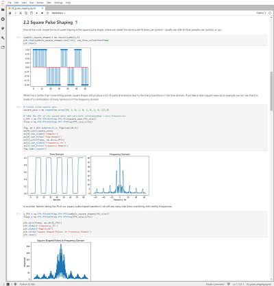
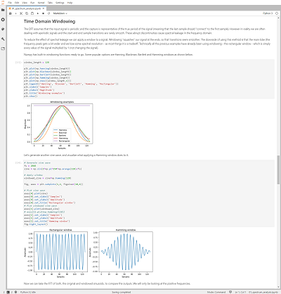
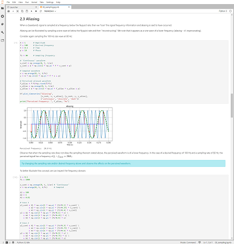
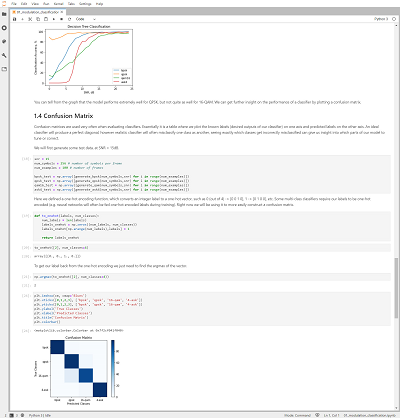

# RFSoC 2x2 overlays

## Base Overlay

The `base` overlay is included in the PYNQ image for the RFSoC 2x2 board and will be available for you to use from the first time you start your board.  The purpose of the base overlay design is to allow you to start exploring your board with PYNQ out-of-the-box. 

See the  [RFSoC 2x2 base overlay](./base_overlay.html) page for more details. 

## Spectrum Analyzer

An RFSoC spectrum analysis tool is available on your RFSoC2x2 from the first time you start your board. The spectrum analyzer was developed by the [University of Strathclyde](https://sdr.eee.strath.ac.uk/) Software Defined Radio (SDR) research laboratory. You can use the spectrum analyzer tool to explore your surrounding RF spectrum.

You can follow this [link to the RFSoC Spectrum Analyzer GitHub page](https://github.com/strath-sdr/rfsoc_sam), where you can update your spectrum analyzer tool, contribute to the project, or post questions and feedback using the issue tracker.

## RFSoC Frequency Planner

An RFSoC frequency planning tool created using Python is available to download and install on your RFSoC2x2 development board. This frequency planning tool is based on the original RFSoC frequency planner that can be downloaded [here](https://www.xilinx.com/publications/products/tools/zynq-ultrascale-plus-rfsoc-frequency-planner-rev1p7.xlsx.zip).

The Python based frequency planner uses widgets that allow the user to dynamically change system properties. You can follow this [link to the RFSoC Frequency Planner GitHub page](https://github.com/strath-sdr/rfsoc_frequency_planner), where you can download the frequency planner tool, contribute to the project, or post questions and feedback using the issue tracker.

## RFSoC Demonstration Repositories

The [University of Strathclyde](https://sdr.eee.strath.ac.uk/) SDR research laboratory has created a series of demonstration projects for the RFSoC2x2 development board. Clicking on the links below will take you to the main GitHub page where these demonstrations are stored.

* [RFSoC OFDM Demonstrator](https://github.com/strath-sdr/rfsoc_ofdm)
* [RFSoC QPSK Demonstrator](https://github.com/strath-sdr/rfsoc_qpsk)
* [RFSoC BPSK Radio Demonstrator](https://github.com/strath-sdr/rfsoc_radio)
* [PYNQ AGC Demonstration](https://github.com/strath-sdr/pynq_agc)

You can obtain all of the above demonstrations by navigating to the [RFSoC Studio](https://github.com/strath-sdr/rfsoc_studio) repository and following the instructions provided in the readme.

## RFSoC Introduction Notebooks

There are a collection of RFSoC introductory notebooks specifically for your RFSoC2x2 development board. You can obtain a copy of the RFSoC introductory notebooks from the following GitHub repository, [RFSoC Notebooks](https://github.com/strath-sdr/rfsoc_notebooks).

## Digital Signal Processing Notebooks

The University of Strathclyde also have a series of Digital Signal Processing for wireless communications notebooks that you may find interesting. These notebooks present introductory material for the following.

Core Topics:
* Sampling and Quantisation
* The Frequency Spectrum
* Modulation and Demodulation
* Baseband Modulation
* Digital Filters

Specialised Topics:
* Machine Learning for Communication Systems
* OFDM Fundamentals

You can obtain a copy of these notebooks from the following GitHub repository, [DSP Notebooks](https://github.com/strath-sdr/dsp_notebooks).

