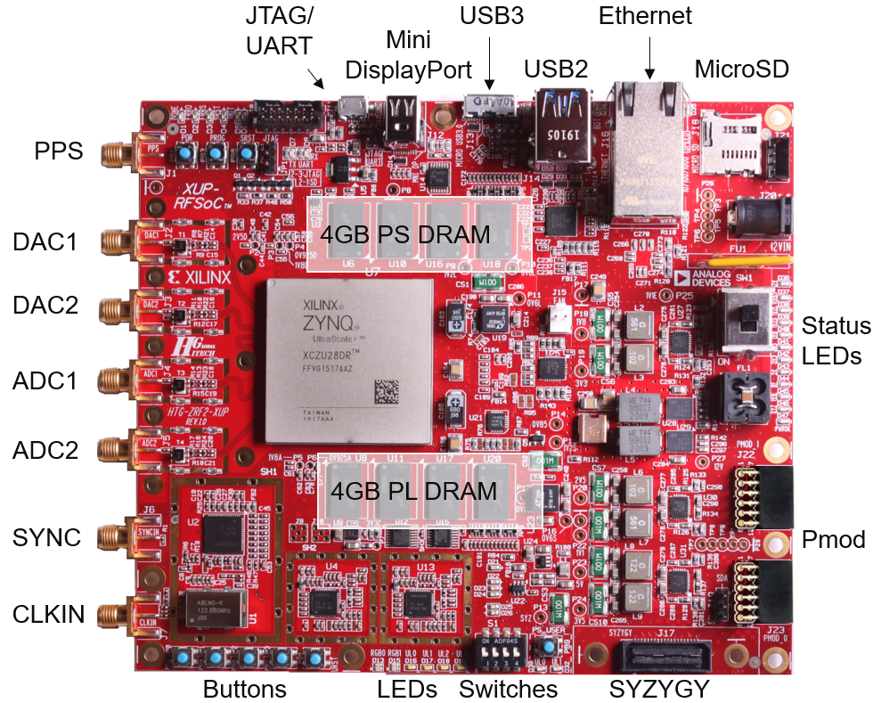

## RFSoC 2x2 board features and interfaces

### Zynq RFSoC device

The *RFSoC 2x2* has a Zynq Ultrascale+ XCZU28DR-FFVG1517AAZ with an Quad-core ARM Cortex A53 Processing System (PS) and Xilinx Ultrascale+ Programmable Logic (PL). The XCZU28DR has 8x RF ADC 8x DACs. The RFsoC 2x2 board has 2x RF ADCs and 2x RF DACs available via SMA connectors. 

There are BALUNs between the SMA connectors and the Zynq RFSoC on the board, which means that antenna and external signal sources can be connected directly to the board. 

## Board Overview

## PS/PL connections

### PS connected

* 4GB DDR4
* Micro SD card port
* Mini Display port
* Ethernet (RJ45)
* Stacked 2-port USB 3.0 host
* USB 3.0 Composite device (Micro USB 3.0 port)
* UART/JTAG (Micro USB 2.0 port)
* 1x User pushbutton
* I2C power monitor

### PL connected

* 2x RF DAC
* 2x RF ADC
* PPS clock & external reference clock
* 4GB DDR4
* SYZYGY STD port
* 2x PMOD
* 4x Switches, 5x User pushbuttons, 4x white user LEDs, 2x RGB LEDs   

### Block Diagram

